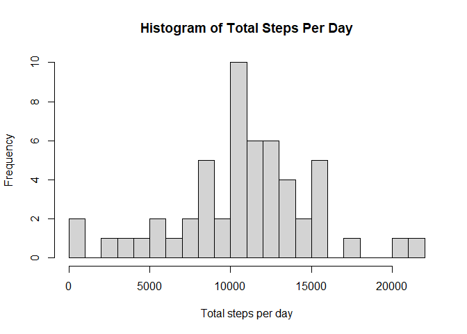
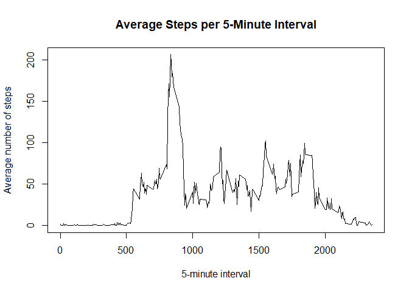
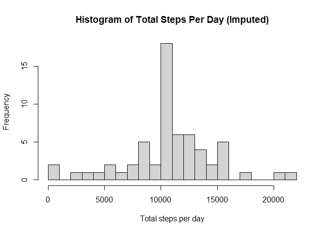
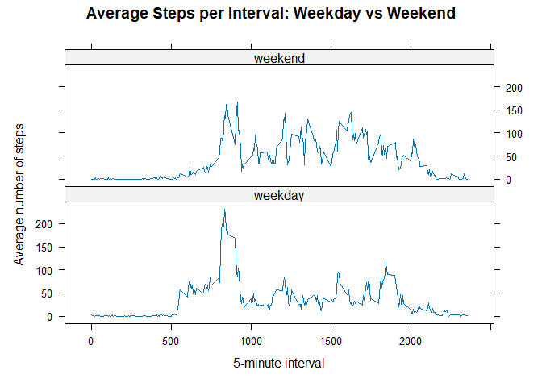

``` r
library(knitr)
opts_chunk$set(echo = TRUE, fig.path = "figure/")
```

## Loading and preprocessing the data

``` r
activity <- read.csv("activity.csv", stringsAsFactors = FALSE)

# Convert date column to Date format
activity$date <- as.Date(activity$date)

# Check structure
str(activity)
```

```
## 'data.frame':	17568 obs. of  3 variables:
##  $ steps   : int  NA NA NA NA NA NA NA NA NA NA ...
##  $ date    : Date, format: "2012-10-01" "2012-10-01" ...
##  $ interval: int  0 5 10 15 20 25 30 35 40 45 ...
```

``` r
head(activity)
```

```
##   steps       date interval
## 1    NA 2012-10-01        0
## 2    NA 2012-10-01        5
## 3    NA 2012-10-01       10
## 4    NA 2012-10-01       15
## 5    NA 2012-10-01       20
## 6    NA 2012-10-01       25
```


## What is mean total number of steps taken per day?


``` r
steps_per_day <- aggregate(steps ~ date, data = activity, FUN = sum, na.rm = TRUE)
head(steps_per_day)
```

```
##         date steps
## 1 2012-10-02   126
## 2 2012-10-03 11352
## 3 2012-10-04 12116
## 4 2012-10-05 13294
## 5 2012-10-06 15420
## 6 2012-10-07 11015
```

``` r
hist(steps_per_day$steps,
     main = "Histogram of Total Steps Per Day",
     xlab = "Total steps per day",
     breaks = 20)
```

<!-- -->

``` r
mean_steps <- mean(steps_per_day$steps)
median_steps <- median(steps_per_day$steps)

mean_steps
```

```
## [1] 10766.19
```

``` r
median_steps
```

```
## [1] 10765
```
The mean total number of steps per day is 1.076619\times 10^{4}.

The median total number of steps per day is 10765.

## What is the average daily activity pattern?

``` r
avg_interval <- aggregate(steps ~ interval, data = activity, FUN = mean, na.rm = TRUE)

head(avg_interval)
```

```
##   interval     steps
## 1        0 1.7169811
## 2        5 0.3396226
## 3       10 0.1320755
## 4       15 0.1509434
## 5       20 0.0754717
## 6       25 2.0943396
```

``` r
plot(avg_interval$interval,
     avg_interval$steps,
     type = "l",
     main = "Average Steps per 5-Minute Interval",
     xlab = "5-minute interval",
     ylab = "Average number of steps")
```

<!-- -->

``` r
max_interval <- avg_interval[which.max(avg_interval$steps), ]
max_interval
```

```
##     interval    steps
## 104      835 206.1698
```
The 5-minute interval with the maximum average number of steps is 835.


## Imputing missing values

``` r
sum(is.na(activity$steps))
```

```
## [1] 2304
```

``` r
# Create a copy of original data
activity_imputed <- activity

# Use the interval means we already calculated earlier
# (avg_interval)

# Match each row’s interval to the interval mean
match_index <- match(activity_imputed$interval, avg_interval$interval)

# Replace NA values
activity_imputed$steps[is.na(activity_imputed$steps)] <- 
  avg_interval$steps[match_index[is.na(activity_imputed$steps)]]

# Check again
sum(is.na(activity_imputed$steps))
```

```
## [1] 0
```

``` r
steps_per_day_imputed <- aggregate(steps ~ date,
                                   data = activity_imputed,
                                   FUN = sum)

head(steps_per_day_imputed)
```

```
##         date    steps
## 1 2012-10-01 10766.19
## 2 2012-10-02   126.00
## 3 2012-10-03 11352.00
## 4 2012-10-04 12116.00
## 5 2012-10-05 13294.00
## 6 2012-10-06 15420.00
```

``` r
hist(steps_per_day_imputed$steps,
     main = "Histogram of Total Steps Per Day (Imputed)",
     xlab = "Total steps per day",
     breaks = 20)
```

<!-- -->

``` r
mean_steps_imputed <- mean(steps_per_day_imputed$steps)
median_steps_imputed <- median(steps_per_day_imputed$steps)

mean_steps_imputed
```

```
## [1] 10766.19
```

``` r
median_steps_imputed
```

```
## [1] 10766.19
```
Mean before imputation: 1.076619\times 10^{4}  
Median before imputation: 10765

Mean after imputation: 1.076619\times 10^{4}  
Median after imputation: 1.0766189\times 10^{4}
After imputing missing values using the interval mean, the mean and median total steps per day increased slightly.
This suggests that missing days previously reduced the overall daily totals.

## Are there differences in activity patterns between weekdays and weekends?

``` r
# Create weekday/weekend factor
activity_imputed$day_type <- ifelse(
  weekdays(activity_imputed$date) %in% c("Saturday", "Sunday"),
  "weekend",
  "weekday"
)

activity_imputed$day_type <- factor(activity_imputed$day_type)

table(activity_imputed$day_type)
```

```
## 
## weekday weekend 
##   12960    4608
```

``` r
avg_by_type <- aggregate(steps ~ interval + day_type,
                         data = activity_imputed,
                         FUN = mean)

head(avg_by_type)
```

```
##   interval day_type      steps
## 1        0  weekday 2.25115304
## 2        5  weekday 0.44528302
## 3       10  weekday 0.17316562
## 4       15  weekday 0.19790356
## 5       20  weekday 0.09895178
## 6       25  weekday 1.59035639
```

``` r
library(lattice)

xyplot(steps ~ interval | day_type,
       data = avg_by_type,
       type = "l",
       layout = c(1, 2),
       xlab = "5-minute interval",
       ylab = "Average number of steps",
       main = "Average Steps per Interval: Weekday vs Weekend")
```

<!-- -->

